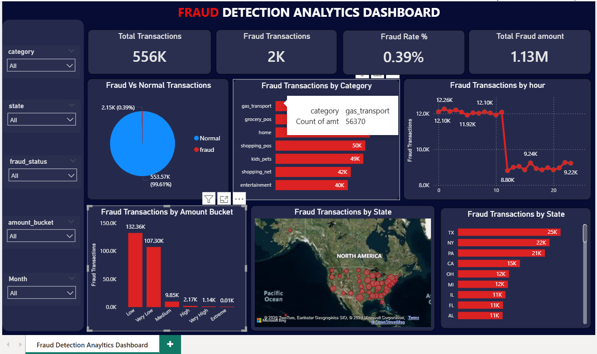

# Credit Card Fraud Analysis Dashboard

## Project Overview
This project analyzes credit card transaction data to identify fraud patterns based on transaction amount, category, location, and transaction time. The objective is to support fraud monitoring and business decision-making using an interactive Power BI dashboard.

---

## Tools & Technologies
- Python
- Pandas
- Power BI
- Excel

---

## Data Cleaning & Preparation
Performed data cleaning and feature engineering using Python:
- Converted transaction date-time column
- Created hour, month, and day features
- Created fraud status labels
- Created transaction amount buckets
- Removed unnecessary columns
- Exported cleaned dataset for visualization

---

## Dashboard KPIs
- Total Transactions
- Fraud Transactions
- Fraud Rate %
- Total Fraud Amount

---

## Dashboard Features
- Fraud vs Normal Transactions
- Fraud by Category
- Fraud by Hour
- Fraud by State
- Fraud by Amount Bucket
- Interactive Filters & Slicers

---

## Key Business Insights
- Fraud transactions represent a small percentage of total transactions but create significant financial impact.
- Gas transport, grocery, and shopping categories show higher fraud activity.
- Certain states report higher fraud concentration.
- Fraud patterns vary across transaction amount ranges and time periods.

---

## Dashboard Preview

---

## Business Impact
This dashboard helps businesses monitor suspicious transaction behavior, identify high-risk patterns, and support fraud prevention decisions through data-driven insights.
